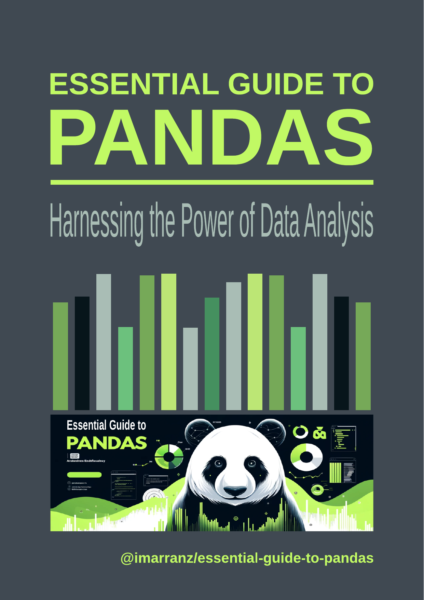

# Introduction

Welcome to our in-depth manual on Pandas, a cornerstone Python library that is indispensable in the realms of data science and analysis. Pandas provides a rich set of tools and functions that make data analysis, manipulation, and visualization both accessible and powerful.


<div class="cover">
    <div class="cover-content">
        <div class="cover-image">
            
        </div>
        <div class="cover-text">
            <p style="color: #403724; font-size: 1.2rem;"><b>Essential Guide to Pandas</b></p>
            <p>Welcome to our in-depth manual on Pandas, a cornerstone Python library that is indispensable in the realms of data science and analysis. Pandas provides a rich set of tools and functions that make data analysis, manipulation, and visualization both accessible and powerful.</p>
            <p align="left">
            <a href="https://github.com/imarranz/essential-guide-to-pandas/pulls">
                
            </a>
            <a href="LICENSE.md">
                
            </a>
            <a href="https://github.com/imarranz/essential-guide-to-pandas">
                
            </a>
            <a href="https://github.com/imarranz/essential-guide-to-pandas">
                <br>
            <a href="https://imarranz.github.io/essential-guide-to-pandas/">
                
            </a>
            <a href="https://drive.google.com/file/d/1jEubPytIIVqD0EfTxZOa3jpu4TokHyHR/view?usp=drive_link">
                
            </a>
            </p>
        </div>
    </div>
</div>

## Contact Information

For any inquiries or further information about this project, please feel free to contact Ibon Martínez-Arranz. Below you can find his contact details and social media profiles.

<div class="cover">
    <div class="cover-content">
        <div class="cover-image">
            
        </div>
        <div class="cover-text">
            <p style="color: #403724; font-size: 1.0rem;">I'm Ibon Martínez-Arranz, with a BSc in Mathematics and MScs in Applied Statistics and Mathematical Modeling. Since 2010, I've been with <a href="https://owlmetabolomics.com/">OWL Metabolomics</a>, initially as a researcher and now Head of the Data Science Department, focusing on Machine Learning Prediction, Statistical Computations, and supporting R&D projects.</p>
            <a href="https://github.com/imarranz">
                
            </a>
            <a href="https://www.linkedin.com/in/ibon-martinez-arranz/">
                
            </a>
            <a href="https://pubmed.ncbi.nlm.nih.gov/?term=ibon+Martinez-Arranz">
                
            </a>
            <a href="https://orcid.org/0000-0001-9483-8426">
                
            </a>
        </div>
    </div>
</div>


Pandas, short for "Panel Data", is an open-source library that offers high-level data structures and a vast array of tools for practical data analysis in Python. It has become synonymous with data wrangling, offering the DataFrame as its central data structure, which is effectively a table or a two-dimensional, size-mutable, and potentially heterogeneous tabular data structure with labeled axes (rows and columns).

To begin using Pandas, it's typically imported alongside NumPy, another key library for numerical computations. The conventional way to import Pandas is as follows:

```python
import pandas as pd
import numpy as np
```

In this manual, we will explore the multifaceted features of Pandas, covering a wide range of functionalities that cater to the needs of data analysts and scientists. Our guide will walk you through the following key areas:

  1. **[Data Loading](010_data_loading.md):** Learn how to efficiently import data into Pandas from different sources such as CSV files, Excel sheets, and databases.

  2. **[Basic Data Inspection](020_basic_data_inspection.md):** Understand the structure and content of your data through simple yet powerful inspection techniques.

  3. **[Data Cleaning](030_data_cleaning.md):** Learn to identify and rectify inconsistencies, missing values, and anomalies in your dataset, ensuring data quality and reliability.

  4. **[Data Transformation](040_data_transformation.md):** Discover methods to reshape, aggregate, and modify data to suit your analytical needs.

  5. **[Data Visualization](050_data_visualization_integration.md):** Integrate Pandas with visualization tools to create insightful and compelling graphical representations of your data.

  6. **[Statistical Analysis](060_statistical_analysis.md):** Utilize Pandas for descriptive and inferential statistics, making data-driven decisions easier and more accurate.

  7. **[Indexing and Selection](070_indexing_and_selection.md):** Master the art of accessing and selecting data subsets  efficiently for analysis.

  8. **[Data Formatting and Conversion](080_data_formatting_and_conversion.md):** Adapt your data into the desired format, enhancing its usability and compatibility with different analysis tools.

  9. **[Advanced Data Transformation](090_advanced_data_transformation.md):** Delve deeper into sophisticated data transformation techniques for complex data manipulation tasks.

  10. **[Handling Time Series Data](100_handling_time_series_data.md):** Explore the handling of time-stamped data, crucial for time series analysis and forecasting.

  11. **[File Import/Export](110_file_export.md):** Learn how to effortlessly read from and write to various file formats, making data interchange seamless.

  12. **[Advanced Queries](120_advanced_data_queries.md):** Employ advanced querying techniques to extract specific insights from large datasets.

  13. **[Multi-Index Operations](130_multi-index_operations.md):** Understand the multi-level indexing to work with high-dimensional data more effectively.

  14. **[Data Merging Techniques](140_data_merging_techniques.md):** Explore various strategies to combine datasets, enhancing your analytical possibilities.

  15. **[Dealing with Duplicates](150_dealing_with_duplicates.md):** Detect and handle duplicate records to maintain the integrity of your analysis.

  16. **[Custom Operations with Apply](160_custom_operations_with_apply.md):** Harness the power of custom functions to extend Pandas' capabilities.

  17. **[Integration with Matplotlib for Custom Plots](170_integration_with_matplotlib_for_custom_plots.md):** Create bespoke plots by integrating Pandas with Matplotlib, a leading plotting library.

  18. **[Advanced Grouping and Aggregation](180_advanced_grouping_and_aggregation.md):** Perform complex grouping and aggregation operations for sophisticated data summaries.

  19. **[Text Data Specific Operations](190_text_data_specific_operations.md):** Manipulate and analyze textual data effectively using Pandas' string functions.

  20. **[Working with JSON and XML](200_working_with_json_and_xml.md):** Handle modern data formats like JSON and XML with ease.

  21. **[Advanced File Handling](210_advanced_file_handling.md):** Learn advanced techniques for managing file I/O operations.

  22. **[Dealing with Missing Data](220_dealing_with_missing_data.md):** Develop strategies to address and impute missing values in your datasets.

  23. **[Data Reshaping](230_data_reshaping.md):** Transform the structure of your data to facilitate different types of analysis.

  24. **[Categorical Data Operations](240_categorical_data_operations.md):** Efficiently manage and analyze categorical data.

  25. **[Advanced Indexing](250_advanced_indexing.md):** Leverage advanced indexing techniques for more powerful data manipulation.

  26. **[Efficient Computations](260_efficient_computations.md):** Optimize performance for large-scale data operations.

  27. **[Advanced Data Merging](270_advanced_data_merging.md):** Explore sophisticated data merging and joining techniques for complex datasets.

  28. **[Data Quality Checks](280_data_quality_checks.md):** Implement strategies to ensure and maintain the quality of your data throughout the analysis process.

  29. **[Real-World Case Studies](290_real_word_case_studies.md)**: Apply the concepts and techniques learned throughout the manual to real-world scenarios using the Titanic dataset. This chapter demonstrates practical data analysis workflows, including data cleaning, exploratory analysis, and survival analysis, providing insights into how to utilize Pandas in practical applications to derive meaningful conclusions from complex data sets.

This manual is designed to empower you with the knowledge and skills to effectively manipulate and analyze data using Pandas, turning raw data into valuable insights. Let's begin our journey into the world of data analysis with Pandas.

Pandas, being a cornerstone in the Python data analysis landscape, has a wealth of resources and references available for those looking to delve deeper into its capabilities. Below are some key references and resources where you can find additional information, documentation, and support for working with Pandas:

1. **Official Pandas Website and Documentation:**
    - The official website for Pandas is [pandas.pydata.org](https://pandas.pydata.org/). Here, you can find comprehensive documentation, including a detailed user guide, API reference, and numerous tutorials. The documentation is an invaluable resource for both beginners and experienced users, offering detailed explanations of Pandas' functionalities along with examples.

2. **Pandas GitHub Repository:**
    - The Pandas GitHub repository, [github.com/pandas-dev/pandas](https://github.com/pandas-dev/pandas), is the primary source of the latest source code. It's also a hub for the development community where you can report issues, contribute to the codebase, and review upcoming features.

3. **Pandas Community and Support:**
    - **Stack Overflow:** A large number of questions and answers can be found under the 'pandas' tag on Stack Overflow. It's a great place to seek help and contribute to community discussions.
    - **Mailing List:** Pandas has an active mailing list for discussion and asking questions about usage and development.
    - **Social Media:** Follow Pandas on platforms like Twitter for updates, tips, and community interactions.

4. **Scientific Python Ecosystem:**
    - Pandas is a part of the larger ecosystem of scientific computing in Python, which includes libraries like NumPy, SciPy, Matplotlib, and IPython. Understanding these libraries in conjunction with Pandas can be highly beneficial.

5. **Books and Online Courses:**
    - There are numerous books and online courses available that cover Pandas, often within the broader context of Python data analysis and data science. These can be excellent resources for structured learning and in-depth understanding.

6. **Community Conferences and Meetups:**
    - Python and data science conferences often feature talks and workshops on Pandas. Local Python meetups can also be a good place to learn from and network with other users.

7. **Jupyter Notebooks:**
    - Many online repositories and platforms host Jupyter Notebooks showcasing Pandas use cases. These interactive notebooks are excellent for learning by example and experimenting with code.

By exploring these resources, you can deepen your understanding of Pandas, stay updated with the latest developments, and connect with a vibrant community of users and contributors.

## Contact Information

For any inquiries or further information about this project, please feel free to contact Ibon Martínez-Arranz. Below you can find his contact details and social media profiles.

<div class="cover">
    <div class="cover-content">
        <div class="cover-image">
            
        </div>
        <div class="cover-text">
            <p style="color: #403724; font-size: 1.0rem;">I'm Ibon Martínez-Arranz, with a BSc in Mathematics and MScs in Applied Statistics and Mathematical Modeling. Since 2010, I've been with <a href="https://owlmetabolomics.com/">OWL Metabolomics</a>, initially as a researcher and now Head of the Data Science Department, focusing on Machine Learning Prediction, Statistical Computations, and supporting R&D projects.</p>
            <a href="https://github.com/imarranz">
                
            </a>
            <a href="https://www.linkedin.com/in/ibon-martinez-arranz/">
                
            </a>
            <a href="https://pubmed.ncbi.nlm.nih.gov/?term=ibon+Martinez-Arranz">
                
            </a>
            <a href="https://orcid.org/0000-0001-9483-8426">
                
            </a>
        </div>
    </div>
</div>
